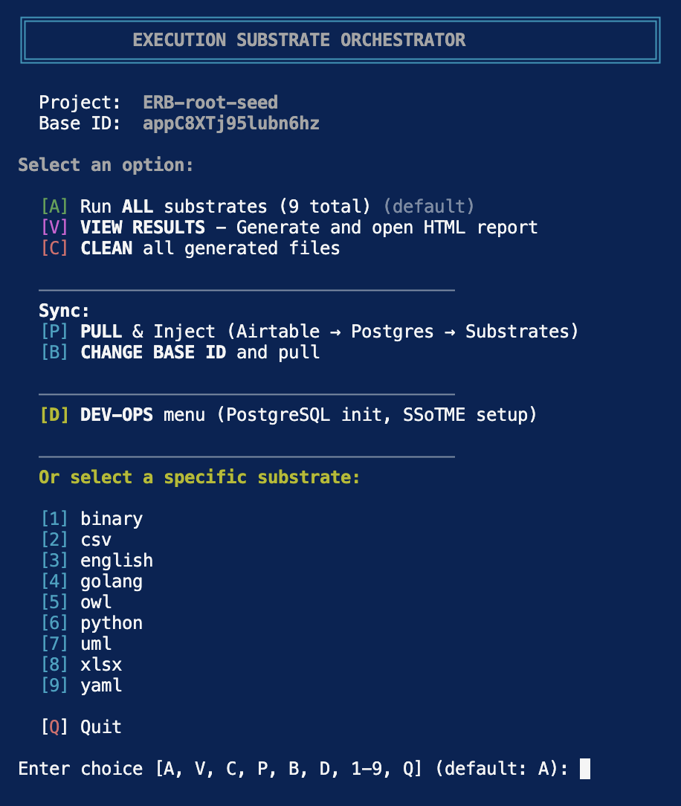
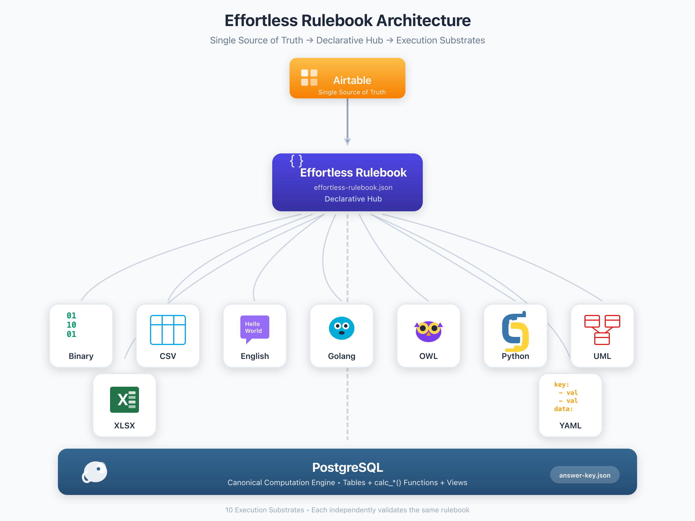

# Effortless Rulebook (ERB)

**One declarative rulebook. Many execution substrates. Consistent results.**

> **[View Full Orchestration Report](orchestration/orchestration-report.html)** — See how execution substrates compute equivalent answers from the same rulebook.

---

## 1. Quick Start (60 seconds)

```bash
./start.sh
```

You'll see the orchestration menu:



Pick option **6** to run all substrates. Watch them derive consistent answers from the same rulebook.

---

## 2. The Architecture in One Diagram



```
┌─────────────────────────────────────────────────────────────┐
│                    SINGLE SOURCE OF TRUTH                   │
│                                                             │
│   Airtable (UI)  →  effortless-rulebook.json (Canonical IR) │
│                                                             │
│   • Schema: raw fields vs calculated fields                 │
│   • Formulas: declarative derivation specs                  │
│   • Data: ground facts                                      │
└─────────────────────────────────────────────────────────────┘
                              │
                              ▼ (generated, not hand-written)
        ┌─────────────────────┼─────────────────────┐
        │                     │                     │
        ▼                     ▼                     ▼
   ┌─────────┐          ┌─────────┐          ┌─────────┐
   │ Postgres│          │ Python  │          │   Go    │  ...
   │ calc_*  │          │ Calc*() │          │ Calc*() │
   │ + views │          │ classes │          │ structs │
   └────┬────┘          └────┬────┘          └────┬────┘
        │                     │                     │
        └─────────────────────┼─────────────────────┘
                              ▼
                    ┌─────────────────────┐
                    │  CONFORMANCE TESTS  │
                    │  answer-key.json vs │
                    │  test-answers.json  │
                    └─────────────────────┘
```

The **ExplainDAG substrate** makes this architecture inspectable: it emits the materialized inference DAG for every calculated field, showing exactly which inputs produced which outputs. Every derivation is a falsifiable artifact, not a black box.

---

## 3. Execution Substrates

Each substrate independently derives answers from the same rulebook. Conformance is measured against a reference execution using typed field comparison:

| Substrate | Type | Status | Conformance | Description |
|-----------|------|:------:|:-----------:|-------------|
| **PostgreSQL** | Database | ✓ | 100% | Tables, `calc_*()` functions, views |
| **Python** | SDK | ✓ | 100% | Dataclasses with `calc_*()` methods |
| **Go** | SDK | ✓ | 100% | Structs with `Calc*()` methods |
| **XLSX** | Spreadsheet | ✓ | 100% | Excel workbook with native formulas |
| **OWL** | Semantic | ✓ | 100%* | Semantic web ontology with SWRL rules |
| **YAML** | Schema | ✓ | 100% | LLM-friendly schema |
| **CSV** | Tabular | ✓ | 100% | Field definitions with computed values |
| **UML** | Diagram | ✓ | 100% | PlantUML class diagrams with OCL constraints |
| **ExplainDAG** | Audit | ✓ | 100% | Derivation DAGs with witnessed values |
| **Binary** | Native | ⚠️ | 54% | C structs + x86 assembly (partial) |
| **English** | Prose | 🔮 | ~78% | Human-readable specification (LLM graded) |

**Legend**: ✓ = Deterministic execution, ⚠️ = Partial implementation, 🔮 = LLM Fuzzy Grading

**Note on conformance scores**: "100%" means typed-identical output on the tested fragment under declared semantics. Substrates like OWL (*) have richer native semantics than the comparison captures—the score reflects agreement on the shared subset, not full semantic equivalence across paradigms.

→ **For substrate implementation details and testing architecture, see [README.TECHNICAL.md](README.TECHNICAL.md)**

---

## 4. Project Structure

```
├── effortless-rulebook/
│   └── effortless-rulebook.json    # ← THE SOURCE OF TRUTH
├── postgres/
│   ├── 01-drop-and-create-tables.sql   # generated base tables
│   ├── 02-create-functions.sql         # generated calc_* functions (the DAG)
│   └── 03-create-views.sql             # generated views calling calc_*
├── execution-substrates/
│   ├── python/                     # Python substrate
│   ├── golang/                     # Go substrate
│   ├── xlsx/                       # Excel substrate
│   ├── owl/                        # OWL substrate
│   ├── explain-dag/                # Derivation DAGs with witnessed values
│   └── ...
├── orchestration/
│   ├── orchestrate.sh              # run all substrates
│   └── test-orchestrator.py        # conformance testing harness
├── testing/
│   ├── answer-keys/                # expected outputs
│   └── blank-tests/                # inputs with calculated fields nulled
├── docs/                           # 20+ deep-dive articles
└── start.sh                        # ← START HERE
```

---

## 5. The Domain Doesn't Matter (Swap It Out)

This repo uses "LanguageCandidates" as an example domain (classifying whether things like "English", "Python", "A Coffee Mug" count as languages). But:

- **The pattern works for ANY domain**
- Point at a different Airtable base → different schema, different data, same machinery
- The orchestration, conformance testing, and derivation DAG patterns are domain-agnostic

To use your own model:
1. Export your Airtable base to `effortless-rulebook.json`
2. Run the generators to create substrate code
3. Run the orchestration to verify conformance

---

## 6. The Problem: Three Questions Nobody Has Good Answers For

When business logic lives in multiple places—SQL, Python, Go, OWL, application code—three questions become urgent:

1. **"Where does truth live?"** When you change a business rule today, can you point to ONE canonical source that updates immediately—and from which all implementations are re-derived? Or do you expect humans to synchronize meaning across multiple artifacts?

2. **"How do you detect when implementations drift?"** When the same domain semantics exist in your database, your validation layer, your queries, and your app logic, what is your mechanism to detect divergence? Do you have conformance tests across substrates, or is correctness established by informal review and piecemeal debugging?

3. **"What is your explanation of an inference?"** For any derived fact, can you produce a machine-readable derivation that shows which inputs produced it—without appealing to "the reasoner decided" or "the pipeline did it"? (See **ExplainDAG** substrate.)

**The usual answer**: "We don't. We synchronize by hand. We hope. We debug."

**This repo's approach**: A working implementation that addresses all three—including the **ExplainDAG substrate**, which emits witnessed derivation DAGs for every calculated field.

---

## 7. The Core Claim

Truth does not live in syntax, code, or serialization.

Truth lives in a **snapshot-consistent declarative model**. All code, files, and formats are projections.

- [Airtable](https://airtable.com/appC8XTj95lubn6hz/shro5WGKLfkfxltQK) — the source of truth (UI)
- [`effortless-rulebook.json`](effortless-rulebook/effortless-rulebook.json) — the canonical hub (IR)
- 11 execution substrates — independent hosts deriving consistent results

This project makes the following claims **falsifiable**:

- Not everything that can be interpreted is a language
- Serialization alone is insufficient to define language
- If something is a language, it must satisfy explicit predicates
- Disagreements about language reduce to predicate choices

If you disagree with a result, you can point to the exact predicate.

→ **For the full philosophical argument, see [README.ARGUMENT.md](README.ARGUMENT.md)**

---

## 8. How This Answers the Three Questions

### 8.1 Where Does Truth Live?

**Answer**: [`effortless-rulebook.json`](effortless-rulebook/effortless-rulebook.json)

- NOT the SQL (that's generated)
- NOT the Python (that's generated)
- One file. One place. Change it here, regenerate everything else.

The rulebook contains declarative formulas:

```json
{
  "name": "PredictedAnswer",
  "type": "calculated",
  "formula": "=AND(\n  {{HasSyntax}},\n  {{RequiresParsing}},\n  {{IsDescriptionOf}},\n  {{HasLinearDecodingPressure}},\n  {{ResolvesToAnAST}},\n  {{IsStableOntologyReference}},\n  NOT({{CanBeHeld}}),\n  NOT({{HasIdentity}})\n)"
}
```

This formula is compiled to Postgres, Python, Go, and any other substrate—not written by hand in each.

### 8.2 How Do You Detect Drift?

**Answer**: Conformance testing against a reference execution.

1. Generate `answer-key.json` from one substrate (the reference execution)
2. Run every other substrate against `blank-test.json` (same inputs, computed fields nulled)
3. Compare outputs field-by-field, row-by-row
4. Drift is detected automatically, not discovered in production

```
┌─────────────────────────────────────────────────────────────┐
│ SUBSTRATE CONFORMANCE RESULTS                               │
├─────────────────────────────────────────────────────────────┤
│ python     ████████████████████████████████████████  100%   │
│ golang     ████████████████████████████████████████  100%   │
│ owl        ████████████████████████████████████████  100%   │
│ xlsx       ████████████████████████████████████████  100%   │
│ yaml       ████████████████████████████████████████  100%   │
│ csv        ████████████████████████████████████████  100%   │
│ uml        ████████████████████████████████████████  100%   │
│ explaindag ████████████████████████████████████████  100%   │
│ binary     █████████████████████░░░░░░░░░░░░░░░░░░░   54%   │
│ english    ███████████████████████████████░░░░░░░░░   78%   │
└─────────────────────────────────────────────────────────────┘
```

### 8.3 What Is Your Explanation of an Inference?

**Answer**: The `calc_*` functions ARE the derivation DAG. The **ExplainDAG substrate** makes this explicit.

**Why no JOINs?** In this architecture, relationships and derived values are first-class nodes in the DAG—not query operators. Each inference depends only on immediate neighbors (its direct inputs), so global semantics emerge from composing local inference nodes. What would be a JOIN in SQL is instead the existence of explicit nodes and edges in the graph.

Every calculated field explicitly shows:
- **Ground facts**: Which base columns it reads
- **Dependencies**: Which other calc functions it calls
- **Logic**: The pure computation

```sql
-- calc_language_candidates_predicted_answer shows the full derivation:
CREATE FUNCTION calc_language_candidates_predicted_answer(p_id TEXT)
RETURNS BOOLEAN AS $$
BEGIN
  RETURN (
    COALESCE((SELECT has_syntax FROM language_candidates WHERE ...), FALSE)
    AND COALESCE((SELECT requires_parsing FROM language_candidates WHERE ...), FALSE)
    AND (calc_language_candidates_is_description_of(p_id) = 'true')  -- ← calls another calc
    AND ...
  );
END;
$$
```

The ExplainDAG substrate goes further—it produces **machine-readable derivation artifacts** with witnessed values at every node:

```json
{
  "explanations": {
    "HasGrammar": {
      "nodes": {
        "i_result": {"kind": "result", "value": true},
        "i_op_1": {"kind": "op", "name": "=", "value": true},
        "i_ref_1": {"kind": "field_ref", "field": "HasSyntax", "value": true}
      },
      "edges": [["i_ref_1", "i_op_1"], ["i_op_1", "i_result"]]
    }
  }
}
```

You can trace any derived value back to its inputs mechanically. No "the reasoner decided."

---

## 9. Two Empirical Invariants

This repository is defined by two observable properties that distinguish it from traditional ontology or model-driven workflows.

### The Rename Test

A system approaches a **single source of ontological truth** when an entity can be renamed **once** and that rename propagates across **all generated substrates** without search, heuristics, or manual coordination.

Rename a column in Airtable → regenerate → PostgreSQL functions, Python dataclasses, Go structs, Excel formulas, OWL ontologies all update **consistently**.

> **If renaming does not propagate, the system has multiple texts—not a single ontology.**

### Interpreter-Free Semantic Completeness

In traditional workflows, OWL artifacts require natural-language annotations to be re-interpreted downstream. Here, the rulebook aims for **semantic completeness prior to projection**. Substrates are generated as **high-fidelity projections** of the declared semantics—minimizing the need for downstream interpretation.

→ **For the full treatment of these invariants, see [README.ARGUMENT.md](README.ARGUMENT.md)**

---

## 10. The Predicates & Core Formula

The evaluation uses 12 raw predicates and 5 calculated fields to classify whether something is a "language."

### The Core Formula

```
top_family_feud_answer = AND(
  has_syntax,
  NOT(can_be_held),
  has_linear_decoding_pressure,
  requires_parsing,
  stable_ontology_reference,
  NOT(has_identity),
  distance_from_concept = 2
)
```

### Quick Evaluation Examples

| Candidate | Syntax | Holdable | Linear | Parsing | Stable | Identity | Distance | Language? |
|-----------|:------:|:--------:|:------:|:-------:|:------:|:--------:|:--------:|:---------:|
| English | ✓ | ✗ | ✓ | ✓ | ✓ | ✗ | 2 | **Yes** |
| Python | ✓ | ✗ | ✓ | ✓ | ✓ | ✗ | 2 | **Yes** |
| A Chair | ✗ | ✓ | ✗ | ✗ | ✗ | ✓ | 1 | **No** |
| A Coffee Mug | ✗ | ✓ | ✗ | ✗ | ✗ | ✓ | 1 | **No** |

→ **For the full predicate definitions and 25-candidate evaluation matrix, see [README.ARGUMENT.md](README.ARGUMENT.md)**

---

## 11. Detailed Walkthrough

### 11.1 The Rulebook Format

The `effortless-rulebook.json` contains:

- **Schema**: Each field marked as `"type": "raw"` (ground fact) or `"type": "calculated"` (derived)
- **Formulas**: Excel-like syntax with `{{FieldName}}` references
- **Data**: The actual records (ground facts)

```json
{
  "name": "HasGrammar",
  "datatype": "boolean",
  "type": "calculated",
  "formula": "={{HasSyntax}} = TRUE()"
}
```

### 11.2 Code Generation

Each substrate generator reads the rulebook and produces:

- **Postgres**: `calc_tablename_fieldname()` functions + `vw_tablename` views
- **Python**: Classes with `calc_field_name()` methods
- **Go**: Structs with `CalcFieldName()` methods
- **Excel**: Workbooks with formula cells
- **OWL**: Ontology definitions with SWRL rules

### 11.3 The Orchestration Harness

1. **answer-key.json**: Complete expected outputs (all calculated fields populated)
2. **blank-test.json**: Same records, but calculated fields set to null
3. **Per-substrate runners**: Load blank-test, execute Calc*() functions, emit test-answers.json
4. **Grading**: Compare test-answers.json to answer-key.json, report pass/fail per field per row

### 11.4 Adding a New Substrate

1. Create a generator that reads `effortless-rulebook.json`
2. Emit code with Calc*() functions 1:1 with calculated fields
3. Implement a test runner that loads `blank-test.json`, runs the calcs, emits `test-answers.json`
4. Add to orchestration menu

---

## 12. FAQ / Objections

**"Isn't Airtable the source of truth?"**
No, Airtable is the UI. The exported `effortless-rulebook.json` is the canonical artifact. You could use any UI that produces the same JSON format.

**"What about non-deterministic substrates?"**
The orchestration includes a "fuzzy evaluation" mode where an LLM grades whether English/DOCX/UML outputs imply the correct computed values. This is explicitly non-deterministic and marked as such.

**"How is this different from dbt/MetricFlow/DMN/Substrait/etc?"**
Those tools solve subsets of the problem:
- dbt/MetricFlow: Metrics → SQL (no multi-language conformance)
- DMN: Decisions → engine execution (no SQL/Python/Go parity)
- Substrait: Relational IR (no business rule semantics)

ERB integrates these pieces: one IR → multiple substrates → conformance testing → derivation traceability.

**"What about versioning/time-travel?"**
The rulebook is a JSON file—version it with git. Derivation functions are deterministic, so you can replay any version.

---

## 13. What's Next / Roadmap

- [ ] Property-based test generation from the rulebook
- [ ] Explanation artifacts (emit derivation DAG as queryable data)
- [ ] More substrates (SPARQL execution, DOCX export)
- [ ] Bi-temporal support (valid-time + transaction-time)
- [ ] Complete binary substrate implementation

---

## 14. Further Reading

### Deep-Dive Documentation

| Document | Description |
|----------|-------------|
| **[README.ARGUMENT.md](README.ARGUMENT.md)** | The philosophical foundation: predicates, evaluation matrix, the full argument about what constitutes "language" |
| **[README.TECHNICAL.md](README.TECHNICAL.md)** | Implementation deep dive: testing architecture, substrate details, fuzzy evaluation, transpilers |
| **[README.SCHEMA.md](README.SCHEMA.md)** | Schema reference for the rulebook format |

### Article Series

See the [`docs/`](docs/) folder for 20+ deep-dive articles:

| Article | Topic |
|---------|-------|
| [Article 01](docs/Article01-The-Single-Source-of-Truth-Problem/) | The Single Source of Truth Problem |
| [Article 02](docs/Article02-The-Airtable-Rulebook/) | The Airtable Rulebook |
| [Article 03](docs/Article03-The-Orchestration-Layer/) | The Orchestration Layer |
| [Article 04](docs/Article04-The-Formula-Compilation-Pipeline/) | The Formula Compilation Pipeline |
| [Article 05](docs/Article05-PostgreSQL/) | PostgreSQL Substrate |
| [Article 06](docs/Article06-The-Python-Substrate/) | Python Substrate |
| [Article 07](docs/Article07-Excel-XLSX/) | Excel/XLSX Substrate |
| [Article 08](docs/Article08-OWL-RDF-and-SHACL/) | OWL, RDF, and SHACL |
| [Article 09](docs/Article09-The-Binary-Substrate/) | The Binary Substrate |
| [Article 10](docs/Article10-SPARQL/) | SPARQL |
| [Article 11](docs/Article11-GraphQL/) | GraphQL |
| [Article 12](docs/Article12-Go-and-Golang/) | Go/Golang Substrate |
| [Article 13](docs/Article13-UML-and-PlantUML/) | UML and PlantUML |
| [Article 14](docs/Article14-The-English-Substrate/) | The English Substrate |
| [Article 15](docs/Article15-The-Invariant-System/) | The Invariant System |
| [Article 16](docs/Article16-Falsifiers-and-the-Scientific-Method/) | Falsifiers and the Scientific Method |
| [Article 17](docs/Article17-The-CMCC-Conjecture/) | The CMCC Conjecture |
| [Article 18](docs/Article18-Flatland-vs-Spaceland/) | Flatland vs Spaceland |
| [Article 19](docs/Article19-The-M4-Layer/) | The M4 Layer |
| [Article 20](docs/Article20-Past-Present-and-Future-Languages/) | Past, Present, and Future Languages |

### Downloadable Artifacts

| Artifact | Description |
|----------|-------------|
| [`effortless-rulebook.json`](effortless-rulebook/effortless-rulebook.json) | The canonical rulebook (JSON) |
| [`rulebook.xlsx`](execution-substrates/xlsx/rulebook.xlsx) | Excel workbook with live formulas |
| [`language_candidates.csv`](execution-substrates/csv/language_candidates.csv) | Flat CSV of all candidates |
| [`specification.md`](execution-substrates/english/specification.md) | Human-readable English specification |

---

## 15. Contributing / License

Contributions welcome. See [CONTRIBUTING.md](CONTRIBUTING.md) for guidelines.

License: [MIT](LICENSE)

---

*Generated from [effortless-rulebook.json](effortless-rulebook/effortless-rulebook.json)*
