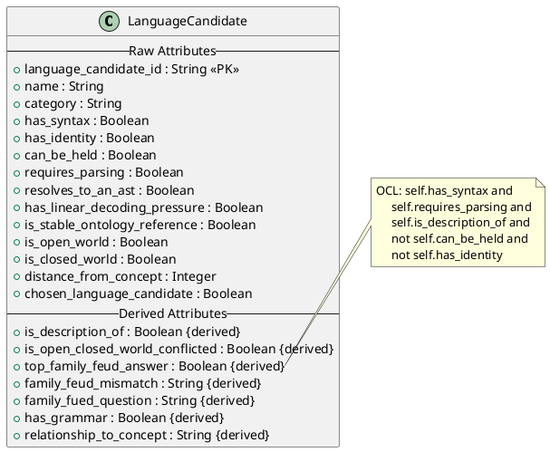
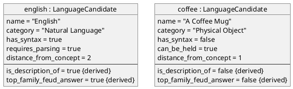

# Article 13: UML and PlantUML — Executable Diagrams with OCL

UML diagrams are usually documentation that drifts from reality. ERB generates PlantUML class diagrams and object diagrams that are always current—plus OCL (Object Constraint Language) derive expressions for computed fields. This article shows how the visual model stays synchronized with the executable code, and how `model.json` enables programmatic OCL evaluation.

---

## Detailed Table of Contents

### 1. The Documentation Drift Problem
- **The Lie**: UML diagrams created at project start, never updated
- **The Reality**: Diagrams that don't match code are worse than no diagrams
- **The Solution**: Generate diagrams from the same source as the code
- **Test Time**: 100ms

### 2. The Generated Files

```
execution-substrates/uml/
├── model.json             # Machine-readable model with OCL
├── model.puml             # PlantUML syntax for diagrams
├── inject-into-uml.py     # Code generator
├── take-test.py           # Test runner (evaluates OCL)
├── test-answers.json      # Output for grading
└── README.md
```

### 3. The `model.json` Structure

```json
{
  "classes": [
    {
      "name": "LanguageCandidate",
      "attributes": [
        {
          "name": "language_candidate_id",
          "type": "String",
          "kind": "raw"
        },
        {
          "name": "has_syntax",
          "type": "Boolean",
          "kind": "raw"
        },
        {
          "name": "is_description_of",
          "type": "Boolean",
          "kind": "derived",
          "derivation": "self.distance_from_concept > 1"
        },
        {
          "name": "top_family_feud_answer",
          "type": "Boolean",
          "kind": "derived",
          "derivation": "self.has_syntax and self.requires_parsing and self.is_description_of and self.has_linear_decoding_pressure and self.resolves_to_an_ast and self.is_stable_ontology_reference and not self.can_be_held and not self.has_identity"
        }
      ]
    }
  ]
}
```

### 4. OCL (Object Constraint Language) Derivations

OCL is the OMG standard for expressing constraints on UML models:

#### 4.1 Level 1 Derivations
```ocl
context LanguageCandidate::is_description_of : Boolean
derive: self.distance_from_concept > 1

context LanguageCandidate::is_open_closed_world_conflicted : Boolean
derive: self.is_open_world and self.is_closed_world

context LanguageCandidate::has_grammar : Boolean
derive: self.has_syntax

context LanguageCandidate::family_fued_question : String
derive: 'Is ' + self.name + ' a language?'
```

#### 4.2 Level 2 Derivations
```ocl
context LanguageCandidate::top_family_feud_answer : Boolean
derive:
    self.has_syntax
    and self.requires_parsing
    and self.is_description_of      -- Level 1 derived
    and self.has_linear_decoding_pressure
    and self.resolves_to_an_ast
    and self.is_stable_ontology_reference
    and not self.can_be_held
    and not self.has_identity
```

#### 4.3 Level 3 Derivations
```ocl
context LanguageCandidate::family_feud_mismatch : String
derive:
    if self.top_family_feud_answer <> self.chosen_language_candidate then
        self.name + ' ' +
        (if self.top_family_feud_answer then 'Is' else 'Isn''t' endif) +
        ' a Family Feud Language, but ' +
        (if self.chosen_language_candidate then 'Is' else 'Is Not' endif) +
        ' marked as a ''Language Candidate.'''
    else
        ''
    endif +
    (if self.is_open_closed_world_conflicted then
        ' - Open World vs. Closed World Conflict.'
    else '' endif)
```

### 5. The PlantUML Diagram — `model.puml`



### 6. Rendering the Diagram

```bash
# Generate PNG
plantuml model.puml

# Generate SVG
plantuml -tsvg model.puml

# Online: paste into plantuml.com
```

### 7. The Test Runner — OCL Evaluation

```python
def take_test():
    # 1. Load model with OCL derivations
    with open('model.json') as f:
        model = json.load(f)

    # 2. Load test data
    with open('../../testing/blank-test.json') as f:
        test_data = json.load(f)

    # 3. For each record, evaluate OCL derivations
    results = []
    for record in test_data:
        # Create OCL context with record values
        context = OclContext(record)

        # Evaluate derived attributes in DAG order
        for attr in sorted_by_dependency(model['classes'][0]['attributes']):
            if attr['kind'] == 'derived':
                value = evaluate_ocl(attr['derivation'], context)
                record[attr['name']] = value

        results.append(record)

    # 4. Write results
    with open('test-answers.json', 'w') as f:
        json.dump(results, f)
```

### 8. Formula → OCL Translation

| Airtable Formula | OCL Expression |
|------------------|----------------|
| `={{HasSyntax}}` | `self.has_syntax` |
| `=NOT({{CanBeHeld}})` | `not self.can_be_held` |
| `=AND(A, B)` | `a and b` |
| `="Is " & {{Name}} & "..."` | `'Is ' + self.name + '...'` |
| `=IF(X = 1, "A", "B")` | `if x = 1 then 'A' else 'B' endif` |
| `={{Distance}} > 1` | `self.distance > 1` |

### 9. Test Results

- **Pass Rate**: 100% (0 failures)
- **Execution Time**: 100ms
- **OCL Expressions Evaluated**: 7 per record × 125 records

### 10. Why OCL Matters

| Feature | Benefit |
|---------|---------|
| **Standardized** | OMG specification, tool support |
| **Executable** | Can be evaluated programmatically |
| **Model-Integrated** | Lives alongside UML |
| **Platform-Independent** | Not tied to any language |

### 11. Diagram as Single Source of Truth

Traditional workflow:
```
Design → Create UML → Write Code → Code drifts → UML is wrong
```

ERB workflow:
```
Rulebook → Generate UML → Generate Code → Always synchronized
```

### 12. Object Diagrams — Instance Visualization



### 13. Integration with Enterprise Tools

The generated `model.json` can be imported into:
- **Enterprise Architect**: For formal UML modeling
- **MagicDraw**: For SysML/UML tooling
- **Eclipse Papyrus**: For open-source UML

---

## Key Files Referenced in This Article

| File | Purpose |
|------|---------|
| [model.json](../../execution-substrates/uml/model.json) | Machine-readable model + OCL |
| [model.puml](../../execution-substrates/uml/model.puml) | PlantUML source |
| [inject-into-uml.py](../../execution-substrates/uml/inject-into-uml.py) | Generator |
| [take-test.py](../../execution-substrates/uml/take-test.py) | OCL evaluator |

---

*Article content to be written...*
